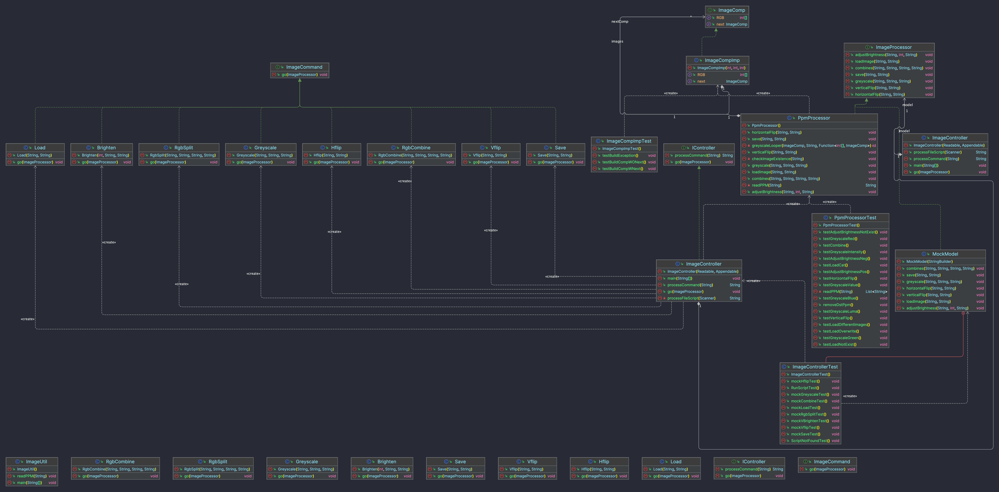

# CS5010 Assignment4: Image Manipulation and Enhancement
Member: Queenie, Cheng    
Date: March 3 2023   
Professor: Amit Shesh

## Project idea
Developing a text-based Image Process program with MVC design idea.

## Project Structure



## Overview
We developed this project based on a Model + View + Controller (MVC) concept. However, as this is a text-based program, so View is not applicable in this case.

In general, Controller takes input from users then ask Model to execute desired action(s); Model is where computation takes place.

In our infrastructure, Controller takes input from user. Invokes desired action(s) provided by Model if those operations are valid, return 'unknown' to user otherwise.


## Controller
``` bash
IME/controller
    ├── IController.java
    ├── ImageController.java
    ├── ImageCommand.java
    └── command
        ├── Brighten.java
        ├── Greyscale.java
        ├── Hflip.java
        ├── Load.java
        ├── RgbCombine.java
        ├── RgbSplit.java
        ├── Save.java
        └── Vflip.java
```

### Design

>The interface`IController` will only have two methods:
- `processCommand(String command)`  takes single line of string from Input and delegate to creat command object to execute.
- `go(ImageProcessor model)` pass the model to control and start running.

>Implementation `ImageController` will have extra helper method:
- `processFileScript(Scanner fileScan)` to call processCommand line by line.
- `main()` to run the program.

>The interface`ImageCommand` represent a command object, which is sequence of operation on model.

We have several atomic commands like(`Save`,`Load`,`Greyscale` ..etc) and now we can use these command to implements other command base on sequences of these atomic command.   
(For example, we can do RGB split by just use Greyscale three time.） This makes it easy for future extensions.

### Control flow
The major control flow will be done inside `processCommand()` implementation which takes a String command.

First, parse it into two part: commandType and List of Arguments by calling *scanner.next()* in a loop.

Secondly, we make a switch to determine what kind of command object to creat and what kind of error checking to apply.

Finally, If the command string fall into one case and get created successfully. We just call the `cmd.go()` to delegate the operations to the model.

### Fields
- `private ImageProcessor model`
- `private final Readable in`
- `private final Appendable out`

Beside the `ImageProcessor` model to operate on. We also store the Input as *Readable* and Output as *Appendable*. 
This makes the controller capable to take not just *System.in/ out* but also files or simple string.


## Model
### Data Structure
Image is composed by a group of components.
Each component is a combination of Red, Green, and Blue (RGB).
Hence, we store a image as a Linked List: each compontent is a Node of Linked List who contains the reference of it's next component.

e.g. Node(RGB = 0,0,0) -> Node(RGB = 0,0,1) -> Node(RGB = 0,0,2) -> NULL

From our codes, `ImageComp` is the interface to indicate what a Node should be and actions available:
- Returning it's RGB value
- Setting it's next component
- Getting it's next component

`ImageCompImp` is a class to implement interface `ImageComp`.

### Computation
`ImageProcessor` is an interface to indicate what kind of actions a processor should have:
- Load
- Greyscale : red-component / green-component / blue-component / value-component / intensity-component / luma-component
- Flip
  - Horizontal
  - Vertical
- Combine
- Save

In reality, there are various image format, e.g. PNG, JPG, BMP, etc.
In this project, our goal is to process images in ASCII PPM format, hence we implement `ImageProcessor` as `PpmProcessor`.

``` bash
IME/model
    ├── ImageComp.java
    ├── ImageCompImp.java
    ├── ImageProcessor.java
    └── PpmProcessor.java
```

## Instruction
1.  Run ImageController.java to start the program   
2.  Enter command with parameters separated by spaces **(ex. "Enter Command:run res/script.text")**
>This scripts will run on images files under res/folder and output file will produce to the same folder.

## Citation
Copyright of following images used is owned by Cheng Shi and authorized to use for this assignment.
>- res/cat.ppm  
>- res/building.ppm