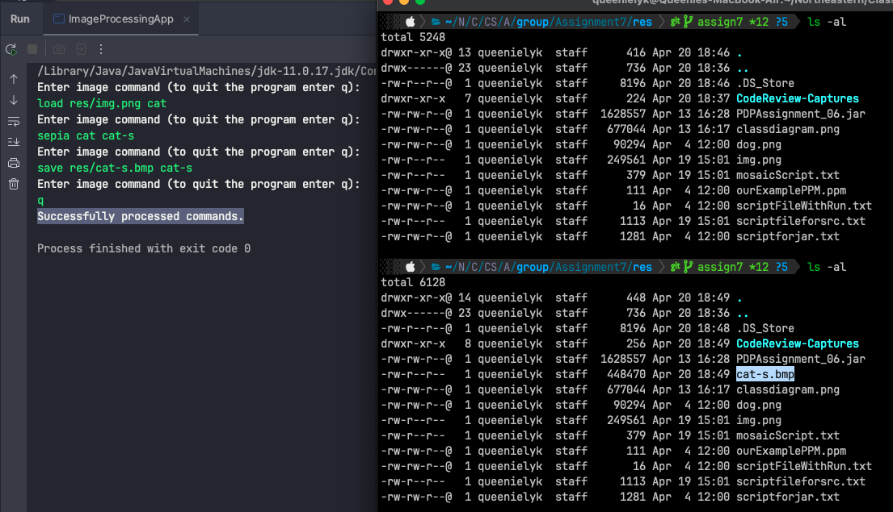

# Code Review

## Design critique

### 1. Insufficient Information Provided for Error Handling

Senders specified their only exceptions types for some potential cases,
e.g. `ImageNotFoundException`, `InvalidFileException`, ...
However, when they simply output `e.getMessage()` at `control/Controller.java:105`, we are unable to understand that the
message is indicating an exception if it's because of `IllegalArgumentException`.
Here is our case:
We were parsing an input into an Integer, but at the wrong place. So the program throws `NumberFormatException` which is
a kind of `IllegalArgumentException`. But what we got from the application is just: `For input string:"dog-m"`.


#### Suggestion

For those non-customized exception, we suggest adding a new `catch(Exception e)` to output more detail about the
exception happened, e.g. `imageView.showOutput(e.toString())`. On the other hand, adding a try-catch for each command
parsing inside `control/LogicController.java` is another approach.

## Implementation critique

### 1. Non-Realtime Error (Console)

An error about loading image was thrown when quitting from the program:


### 2. Non-Realtime Execution (Console)

The execution of text-based is not real time. Commands are added into a list (`control/Controller.java:104`) without
execution as long as `q` is not detected (`control/Controller.java:81`).

Image is not visible on local after executing `save`:


Image is visible on local after executing `quit`:



While the GUI shows updated image and histogram simultaneously, images saved from text-based program are not visible
immediately, which is abnormal to users. If this is a design based on a specific concern or reason, this difference
should be highlighted in `README.md`.

### 3. Failure on Handling NULL input

Started the program with text-based, press `enter` directly without entering any input. The program failed to close
gracefully.


### 4. Variable Type Should Be Interface Type

`control/LogicController.java:34`
> ~~`private final HashMap<String, IImageModel> images;`~~
>
> `private final Map<String, IImageModel> images;`

### 5. Incorrect `dither` image

An image looks uncanny after applying `dither` for multiple times.


```bash
# testing script
load res/dog.png dog-d
dither dog-d dog-d
dither dog-d dog-d
dither dog-d dog-d
dither dog-d dog-d
dither dog-d dog-d
dither dog-d dog-d
dither dog-d dog-d
dither dog-d dog-d
dither dog-d dog-d
dither dog-d dog-d
save res/dog-d.png dog-d
```

We added a test class (`test/imageprocessing/model/FailDitherTest.java : testDitherByReceiver`) to double-check the
correctness of `dither`
as well, but got `AssertionError`.

## Documentation critique

### 1. JavaDoc: Extra `-`

The JavaDoc for all methods with `@param`/`@return`/`@throws`, the senders add `-` in between the parameter's name and
the explanation.
Refer
to [How to Write Doc Comments for the Javadoc Tool](https://www.oracle.com/technical-resources/articles/java/javadoc-tool.html)
from ORACLE, there is no example to put a `-` in between.
Besides, this extra `-` makes the generated JavaDoc looks abnormal, e.g. `imageView - - an object of the view class`.


#### Suggestion

Remove/Do not add `-` between the parameter's name and the explanation when writing JavaDoc.

### 2. Insufficient Information Provided at README.md

#### Suggestion

A good markdown is to let users, who might be completely unfamiliar with your program, understand your design and how to
use. Put on a user hat when writing the markdown may help you to figure out what contents should be included.

#### 1. Markdown Style

A markdown should be easy and clear to read with appropriate styling, but this lack of compartmentalization and title.

##### Suggestion

Preview the markdown before publish. Utilize elements to emphasis sections, keywords and explanations as well.

#### 2. Insufficient Instructions on `How to use our program`

`README.md:82-90` specified how to execute this program without future explanations. Specifically, when users execute
the
program with text mode, `README.md`, `USEME.md`, and `Console` has no information about the accepted commands.

##### Suggestion

Include commands menu in `README.md`, `USEME.md`, and `Console (program starts)` would helps.

## Design/Code Strengths

1. Command design pattern
2. Interface for all classes

## Design/Code Limitations

### 1. GUI: Unable to combine split images

In text-based, users are able to process each split images after `rgb-split`, then combine three images; In
GUI, `Combine` images required user to select images from local drive, thereby the images previously processed
are not able to combining into one.

### 2. GUI: Unable to undo process / Use previous image

In text-based, users are able to process each image by specifying the source name and destination name. The GUI doesn't
provide such option or undo, so users have to re-load an image everytime if they do not that effect after processing the image.

### 3. GUI: Insufficient TextBox width for `Brighten`
While `-100` is a valid input, the TextBox is unable to show the whole input, but part of them, e.g. `-10`.

## Suggestions

### 1. Bigger image for image processing test

To assert the implementation correctness comprehensively, it would be better to use a bigger image (e.g. 3x3 pixels)
instead of 1x1 pixel only.
